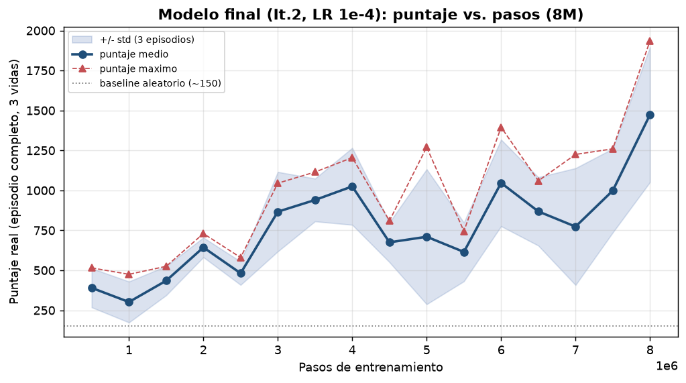

# Deep Q-Learning · Space Invaders (Atari)

Agente de **aprendizaje por refuerzo profundo** que aprende a jugar *Space Invaders*
directamente desde los píxeles de la pantalla, entrenado con **DQN (Deep Q-Network)**.
Partiendo de una recompensa dispersa y sin conocimiento previo del juego, el agente
desarrolla una política capaz de **superar los 1800 puntos**, muy por encima de una
política aleatoria (~150).


---

## Resumen

- **Problema:** aprender a jugar `ALE/SpaceInvaders-v5` (Atari 2600) desde imágenes,
  con recompensa dispersa y estocasticidad (*sticky actions*).
- **Enfoque:** DQN con una CNN (*NatureCNN*) sobre observaciones preprocesadas
  (escala de grises 84×84, apilado de 4 frames), *replay buffer*, red objetivo,
  exploración ε-greedy y *reward clipping*.
- **Resultado:** política final con **1815 de puntaje máximo** y **1022 de
  promedio** en evaluación greedy (20 episodios).
- **Ingeniería:** entrenamiento de 8 M de pasos en GPU (Apple MPS) con *checkpoints*
  reanudables, ejecución de experimentos **en paralelo** para comparar
  configuraciones, y un flujo reproducible de análisis → entrenamiento → evaluación
  → video.

## Resultados

| Métrica | Valor |
|:--------|:------|
| **Puntaje máximo (greedy, 20 episodios)** | **1815** |
| Puntaje promedio | 1022 |
| Mejor partida grabada | 1880 |
| Baseline aleatorio | ~150 |

<p align="center">
  
</p>

Videos del agente jugando: `videos/agente_dqn_final.mp4` (partida completa) y
`videos/agente_dqn_1880.mp4` (mejor partida).

## Enfoque técnico

**Preprocesamiento.** La observación RGB de 210×160×3 se convierte a gris, se
redimensiona a 84×84 y se apilan 4 frames consecutivos para capturar movimiento.
La recompensa se recorta a su signo para estabilizar el aprendizaje de los valores Q.

**Arquitectura (NatureCNN).** Tres capas convolucionales (32×8×8/4, 64×4×4/2,
64×3×3/1) + capa densa de 512 unidades + salida lineal de 6 valores Q, uno por
acción.

**Entrenamiento.** DQN con Adam, pérdida Huber, γ = 0.99, *replay buffer*, red
objetivo actualizada cada 1000 pasos y ε decreciente de 1.0 a 0.01. Evaluación con
política greedy (ε = 0) sobre el episodio completo de 3 vidas y puntaje real.

**Experimentos.** Se compararon tres iteraciones; la de mayor cómputo con la tasa
de aprendizaje base fue la ganadora:

| Iteración | Configuración | Pasos | Puntaje (prom / máx) |
|:----------|:--------------|:------|:---------------------|
| It.1 | DQN base (LR 1e-4) | 2 M | 625 / 1255 |
| **It.2 (final)** | DQN base (LR 1e-4) | 8 M | **1022 / 1815** |
| It.3 | DQN (LR 2.5e-4) | 8 M | 648 / 1175 |

Aprendizaje principal: **más pasos de entrenamiento** fue la mejora más efectiva,
mientras que subir la tasa de aprendizaje perjudicó el desempeño.

## Estructura del repositorio

```
├── notebook/
│   ├── proyecto2.ipynb   # análisis del entorno, entrenamiento, evaluación y video
│   └── ale_utils.py      # utilidades del entorno (creación, ejecución, video)
├── models/               # pesos del modelo final (Stable-Baselines3 .zip)
├── reports/              # figuras de resultados e informe (PDF)
└── videos/               # partidas del agente (.mp4)
```

## Cómo empezar

```bash
python3.12 -m venv venv
source venv/bin/activate
pip install "gymnasium[atari]" ale-py stable-baselines3 numpy matplotlib opencv-python moviepy
```

Los ROMs de Atari vienen incluidos con `ale-py`. Para escribir videos `.mp4` se
recomienda tener `ffmpeg` disponible.

### Cargar el modelo y evaluar

```python
import gymnasium as gym, ale_py
gym.register_envs(ale_py)
from stable_baselines3 import DQN
from stable_baselines3.common.env_util import make_atari_env
from stable_baselines3.common.vec_env import VecFrameStack

modelo = DQN.load("models/dqn_spaceinvaders.zip")

# Entorno de evaluación con el MISMO preprocesamiento (puntaje real, 3 vidas)
env = make_atari_env("ALE/SpaceInvaders-v5", n_envs=1,
                     wrapper_kwargs=dict(clip_reward=False, terminal_on_life_loss=False))
env = VecFrameStack(env, n_stack=4)

obs = env.reset(); done = [False]; total = 0.0
while not done[0]:
    accion, _ = modelo.predict(obs, deterministic=True)
    obs, r, done, _ = env.step(accion); total += float(r[0])
print("Puntaje:", total)
```

> El preprocesamiento de evaluación es idéntico al de entrenamiento (gris 84×84,
> apilado de 4 frames); solo se desactivan el *reward clipping* y el *episodic-life*
> para medir el puntaje real del juego. El notebook automatiza análisis,
> entrenamiento, evaluación y generación de video.

## Stack

Python · PyTorch (Apple MPS) · Stable-Baselines3 · Gymnasium + ALE · NumPy ·
OpenCV · Matplotlib

## Contexto

Proyecto desarrollado para el curso **CC3092 — Deep Learning y Sistemas
Inteligentes** de la **Universidad del Valle de Guatemala**. Más allá del entregable
académico, sirve como caso práctico de extremo a extremo de aprendizaje por refuerzo
profundo aplicado a un entorno de Atari.

## Autor

**Nicolás Concuá**
